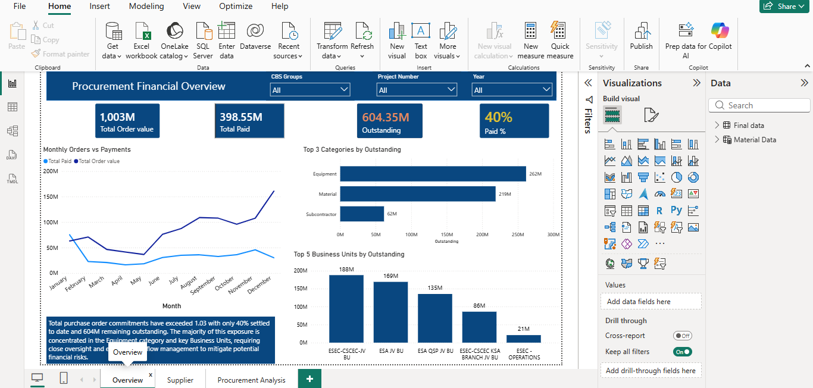
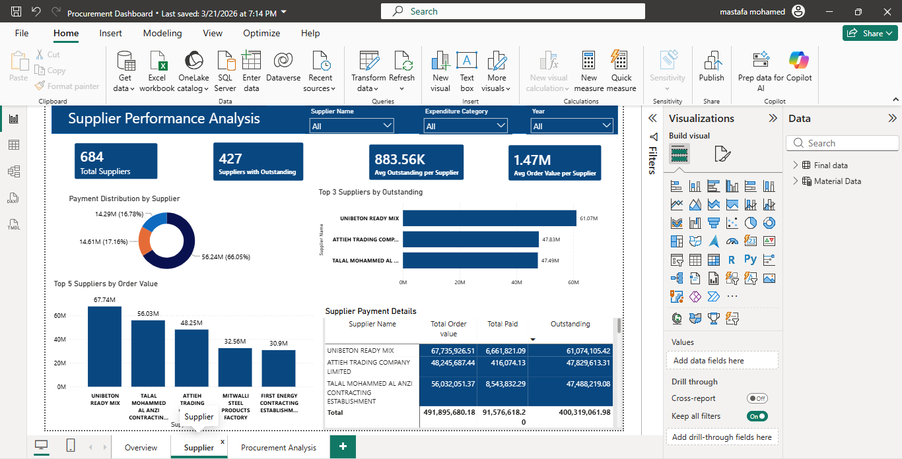
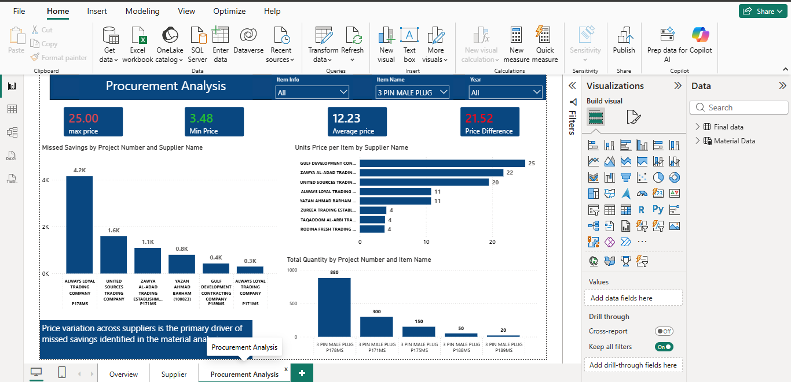

# Procurement & Supply Chain Analysis Dashboard | Power BI

## Project Overview

An interactive Power BI dashboard designed to analyze procurement and supply chain performance, supplier activity, material costs, and purchasing trends.

The dashboard transforms procurement data into actionable business insights to support better purchasing decisions and cost management.

## Business Objectives

- Monitor overall procurement performance.
- Analyze supplier performance and purchasing activity.
- Track material costs and quantities.
- Analyze procurement trends over time.
- Identify cost-saving opportunities.
- Support data-driven procurement decisions.

## Dashboard Pages

- Procurement Overview
- Supplier Performance
- Procurement Analysis

## Tools & Skills

- Power BI
- DAX
- Power Query
- Data Cleaning
- Data Modeling
- KPI Analysis
- Procurement Analysis
- Supplier Analysis
- Data Visualization

## Key Analysis

### 1. Procurement Overview

Provides a high-level view of procurement performance, including key KPIs and overall purchasing activity.

### 2. Supplier Performance

Analyzes supplier activity and performance to identify key suppliers and purchasing patterns.

### 3. Procurement Analysis

Analyzes procurement costs, quantities, and purchasing trends to identify potential cost-saving opportunities.

## Key Skills Demonstrated

- Building interactive Power BI dashboards
- Creating business KPIs
- Data cleaning and transformation
- Data modeling
- DAX measures
- Supplier performance analysis
- Procurement and cost analysis
- Turning business data into actionable insights

## Project Purpose

This project demonstrates practical Power BI and data analysis skills through a real-world procurement and supply chain analysis scenario.
